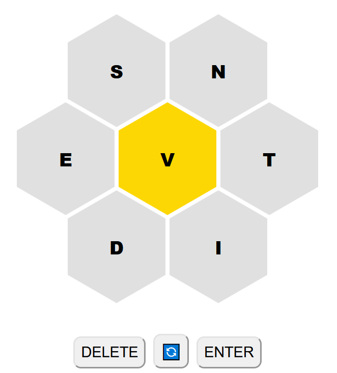

# Bumblewords
## a browser based word finding game

Create as many (> 3 letter) english words as you can, using the given letters.
All words must include the middle letter in yellow and be valid words.
There is also a leaderboard which shows the top scores.

Inspired by the [New York Times Spelling Bee](https://www.nytimes.com/puzzles/spelling-bee) puzzle.

Live demo [here](http://www.bumblewords.com).
